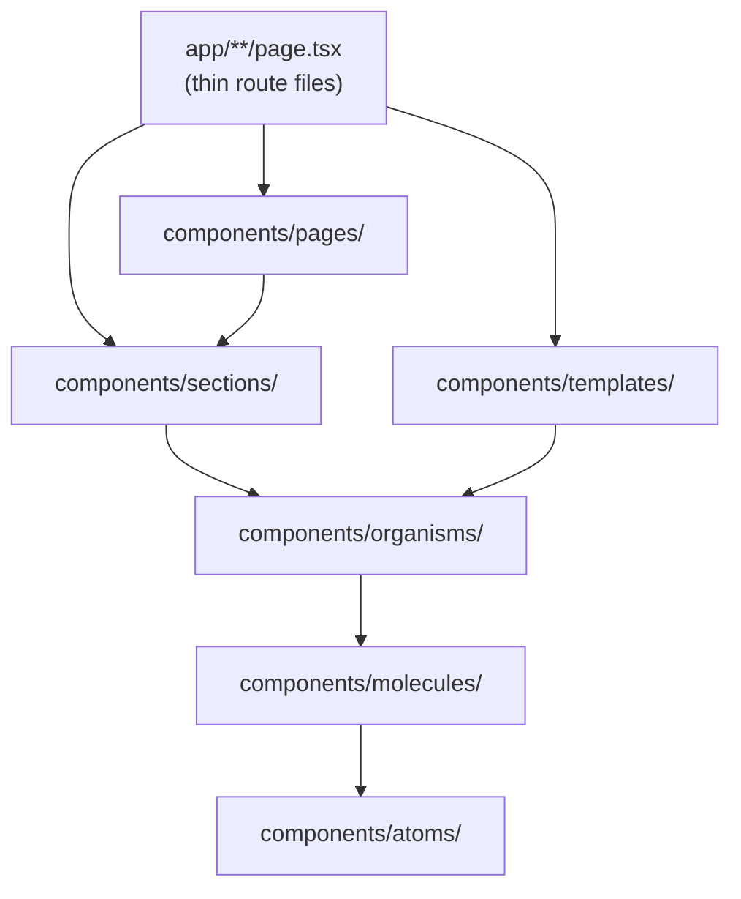

# Storefront Architecture

## Stack

| Layer           | Technology                          | Version |
| --------------- | ----------------------------------- | ------- |
| Framework       | Next.js (App Router)                | 16.2.10 |
| UI              | React                               | 19.2.4  |
| Styling         | Tailwind CSS                        | 4       |
| Data            | Apollo Client                       | 4.2.4   |
| RSC integration | `@apollo/client-integration-nextjs` | 0.14.5  |
| Testing         | Vitest + RTL + MSW                  | 4.1.10  |

## Application architecture

```mermaid
flowchart TB
  subgraph routes [App Router src/app/]
    MAIN["(main)"]
    AUTH["(auth)"]
    CHK["(checkout)"]
    PAY["(payment)"]
  end

  subgraph components [Components src/components/]
    PAGES[pages/]
    SEC[sections/]
    ORG[organisms/]
    MOL[molecules/]
    ATOM[atoms/]
  end

  subgraph lib [Lib src/lib/]
    HOOKS[hooks/]
    PROV[providers/]
    GQL[graphql/]
    DOMAIN[checkout, payment, search...]
  end

  subgraph backend [Backend :3002]
    API[/graphql]
  end

  routes --> PAGES
  PAGES --> SEC --> ORG --> MOL --> ATOM
  routes --> HOOKS
  HOOKS --> GQL --> API
  PROV --> HOOKS
```

## Provider stack

From `src/lib/providers.tsx`:

```typescript
<ApolloNextAppProvider makeClient={makeApolloClient}>
  <AuthProvider>
    <CartProvider>
      <CheckoutProvider>
        {children}
      </CheckoutProvider>
    </CartProvider>
  </AuthProvider>
</ApolloNextAppProvider>
```

Order matters: Apollo must wrap auth (auth uses Apollo mutations), cart depends on auth for merge.

## Data flow patterns

### SSR + hydration (catalog)

Server Component fetches → `PreloadQuery` hydrates → client hook refines.

### Client-only (cart, account)

Provider or hook calls Apollo directly.

### Checkout

Local state in `CheckoutProvider`; mutations via `useCheckout` hook.

See [state management](state-management.md) and [workspace data flow](../../new-sopet-workspace/docs/developer/data-flow.md).

## No direct database access

All data through GraphQL. Business rules live in the backend.

## Component hierarchy



Import direction: always downward (organisms import molecules, never the reverse).

## Related docs

- [Routing](routing.md)
- [Folder structure](folder-structure.md)
