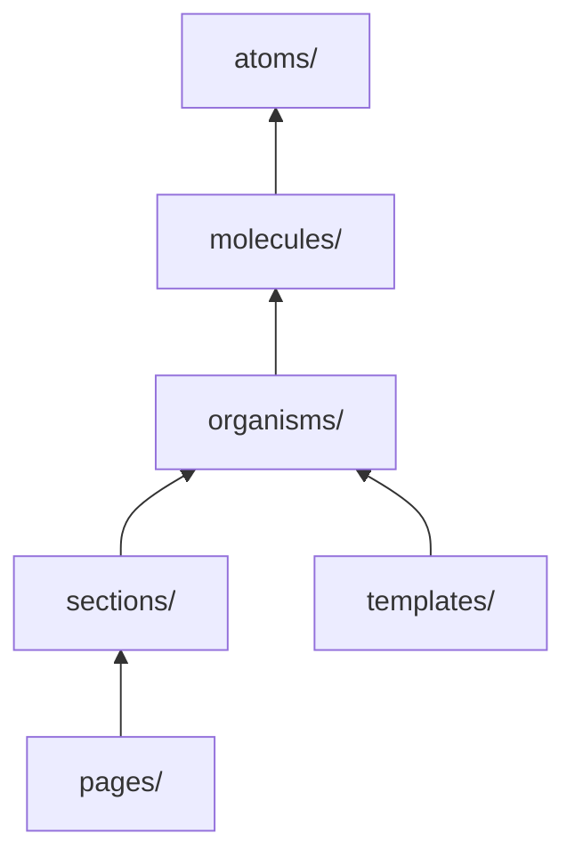

# Components

Atomic design per `src/components/README.md`.

## Hierarchy



**Rule:** Import downward only. Organisms never import from sections.

## Tier guide

| Tier           | When to add                  | Example                                                                 |
| -------------- | ---------------------------- | ----------------------------------------------------------------------- |
| **atoms/**     | Single reusable primitive    | `Button`, `Input`, `Modal`, `Checkbox`, `OtpCodeInput`, `icons/`        |
| **molecules/** | 2–3 atoms composed           | `LoginForm`, `OrderListItem`, `AddressCard`, `CheckoutPaymentSelection` |
| **organisms/** | Self-contained feature block | `Navbar`, `ProductGallery`, `CartItemRow`                               |
| **sections/**  | Page-level content block     | `CartPage`, `CheckoutSection`, `ProductListing`                         |
| **templates/** | Layout shell, guards         | `AccountLayout`, `AccountAuthGuard`                                     |
| **pages/**     | Route-facing composition     | `HomePage`, `SearchResultsPage`, `AccountReviewsPage`                   |
| **util/**      | Non-visual React helpers     | Intended for `ClientOnly`-style wrappers (`src/components/util/`)       |

## File organization

One component per folder:

```text
components/molecules/LoginForm/
├── LoginForm.tsx
└── LoginForm.test.tsx
```

Or single file for simple atoms:

```text
components/atoms/Button.tsx
```

## Styling

Tailwind v4 with SOP design tokens from `src/app/globals.css`:

```tsx
<button className="sop-body-sm-regular bg-sop-primary-100 rounded-sop-8px">
```

Class merging:

```typescript
import { cn } from '@/lib/utils';

<div className={cn('sop-body-sm-regular', isActive && 'text-sop-primary-100')} />
```

Font: Google `Mitr` (loaded in root `layout.tsx`).

## Client boundary

Interactive components need `'use client'`:

```typescript
'use client';

import { useState } from 'react';
```

Server Components (no directive) can be used in `app/` pages for SSR.

### Order tracking components

`src/components/order-tracking/` sits outside the atomic tiers (grouped by feature, kebab-case filenames), including:

- `order-tracking-page-content.tsx`
- `order-tracking-status-header.tsx`
- `order-tracking-progress-stepper.tsx`
- `order-shipment-tracking-list.tsx`
- `order-tracking-not-found-state.tsx`
- `order-tracking-error-state.tsx`
- `order-tracking-loading-state.tsx`
- `order-tracking-success-card.tsx`

Shared between the public `/track/[orderNumber]` page and the authenticated order detail page. See [Routing](routing.md).

### SEO component

`src/components/seo/JsonLdScript.tsx` renders `<script type="application/ld+json">` structured data built by `src/lib/seo/json-ld.ts`. See [SEO](seo.md).

## Testing

Co-locate `ComponentName.test.tsx`:

```typescript
vi.mock('@/lib/hooks/useAuth', () => ({ useAuth: vi.fn() }));

import { render, screen } from '@testing-library/react';
import { LoginForm } from './LoginForm';
```

For components that need Apollo/MSW, wrap with `createApolloTestWrapper()` from `src/test/createApolloTestWrapper.tsx`.

## Related docs

- [Folder structure](folder-structure.md)
- [Architecture](architecture.md)
- [SEO](seo.md)
