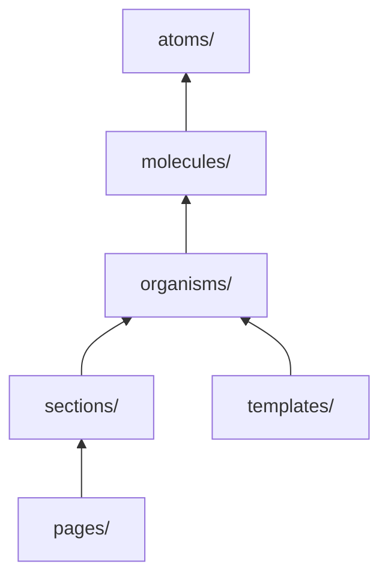

# Components

Atomic design per `src/components/README.md`.

## Hierarchy



**Rule:** Import downward only. Organisms never import from sections.

## Tier guide

| Tier           | When to add                  | Example                                                                  |
| -------------- | ---------------------------- | ------------------------------------------------------------------------ |
| **atoms/**     | Single reusable primitive    | `Button`, `Input`, `Modal`, `StarRating`                                 |
| **molecules/** | 2–3 atoms composed           | `LoginForm`, `OrderListItem`, `DisputeReturnProgress`, `DisputeListCard` |
| **organisms/** | Self-contained feature block | `Navbar`, `ProductGallery`, `CartItemRow`                                |
| **sections/**  | Page-level content block     | `CartPage`, `CheckoutSection`, `ProductListing`                          |
| **templates/** | Layout shell, guards         | `AccountLayout`, `AccountAuthGuard`                                      |
| **pages/**     | Route-facing composition     | `HomePage`, `SearchResultsPage`, `AccountReviewsPage`                    |
| **util/**      | Non-visual helpers           | Wrappers, providers UI doesn't fit elsewhere                             |

## File organization

One component per folder:

```text
components/molecules/LoginForm/
├── LoginForm.tsx
└── LoginForm.test.tsx
```

Or single file for simple atoms:

```text
components/atoms/Button.tsx
```

## Styling

Tailwind v4 with SOP design tokens from `src/app/globals.css`:

```tsx
<button className="sop-body-sm-regular bg-sop-primary-100 rounded-sop-8px">
```

Class merging:

```typescript
import { cn } from '@/lib/utils';

<div className={cn('sop-body-sm-regular', isActive && 'text-sop-primary-100')} />
```

Font: Google `Mitr` (loaded in root `layout.tsx`).

## Client boundary

Interactive components need `'use client'`:

```typescript
'use client';

import { useState } from 'react';
```

Server Components (no directive) can be used in `app/` pages for SSR.

### Return / dispute molecules

| Component                 | Path                                 | Role                                                   |
| ------------------------- | ------------------------------------ | ------------------------------------------------------ |
| `DisputeReturnProgress`   | `molecules/DisputeReturnProgress/`   | 3-step customer journey + next-step copy               |
| `DisputeListCard`         | `molecules/DisputeListCard/`         | Returns list card                                      |
| `OrderStoreDisputeStatus` | `molecules/OrderStoreDisputeStatus/` | Per-store status on order detail                       |
| `ReturnItemPicker`        | `molecules/ReturnItemPicker/`        | Line-item selection (requires `delivered` fulfillment) |

Journey copy: `src/lib/constants/disputeCustomerJourney.ts`. Eligibility: `src/lib/disputes/disputeForOrder.ts`.

## Testing

Co-locate `ComponentName.test.tsx`:

```typescript
vi.mock('@/lib/hooks/useAuth', () => ({ useAuth: vi.fn() }));

import { render, screen } from '@testing-library/react';
import { LoginForm } from './LoginForm';
```

## Related docs

- [Folder structure](folder-structure.md)
- [Architecture](architecture.md)
