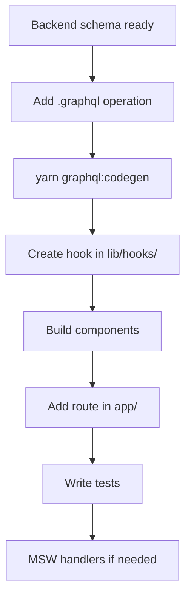

# Feature Development (Storefront)

End-to-end guide for implementing a storefront feature.

## Workflow



## Example: display customer notification count in navbar

### 1. Verify backend query exists

Check `sopet-backend/src/schema.gql` for `unreadNotificationCount` or similar.

### 2. Add GraphQL operation

```graphql
# src/lib/graphql/operations/notifications.graphql
query UnreadNotificationCount {
  unreadNotificationCount
}
```

### 3. Codegen

```bash
yarn graphql:codegen
```

### 4. Create hook

```typescript
// src/lib/hooks/useUnreadNotificationCount.ts
'use client';

import { useQuery } from '@apollo/client/react';
import { UnreadNotificationCountDocument } from '@/lib/graphql/generated/graphql';
import { useAuth } from '@/lib/hooks/useAuth';

export function useUnreadNotificationCount() {
  const { isAuthenticated } = useAuth();
  const { data, loading } = useQuery(UnreadNotificationCountDocument, {
    skip: !isAuthenticated,
  });
  return { count: data?.unreadNotificationCount ?? 0, loading };
}
```

### 5. Update component

```typescript
// src/components/organisms/Navbar/Navbar.tsx
import { useUnreadNotificationCount } from '@/lib/hooks/useUnreadNotificationCount';

const { count } = useUnreadNotificationCount();
// render badge when count > 0
```

### 6. Add test

```typescript
// src/lib/hooks/__tests__/useUnreadNotificationCount.test.ts
// MSW handler returning { unreadNotificationCount: 3 }
```

### 7. MSW handler (if new operation)

```typescript
// src/test/mocks/handlers.ts
graphql.query('UnreadNotificationCount', () => {
  return HttpResponse.json({ data: { unreadNotificationCount: 0 } });
}),
```

## New page checklist

- [ ] Route in correct group (`(main)`, `(auth)`, etc.)
- [ ] Account routes behind `user/layout.tsx` guard if needed
- [ ] SSR preload for catalog-style pages (`revalidate`, `PreloadQuery`)
- [ ] Thai user-facing copy
- [ ] Mobile responsive (test at common breakpoints)
- [ ] `yarn test` passes
- [ ] `yarn lint` passes

## New checkout flow step

1. Add state to `CheckoutProvider`
2. Add validation in `src/lib/checkout/`
3. Wire mutation in `useCheckout.ts`
4. Update `CheckoutSection` organism
5. Test with MSW checkout fixtures (`src/test/mocks/fixtures/checkout.ts`)

## Coordinating with backend

See [cross-repo workflow](../../new-sopet-workspace/docs/developer/cross-repo-workflow.md).

Backend changes must merge and `schema.gql` update before storefront CI passes (CI sparse-checkouts schema from GitHub).

## Related docs

- [Development guide](development-guide.md)
- [GraphQL](graphql.md)
