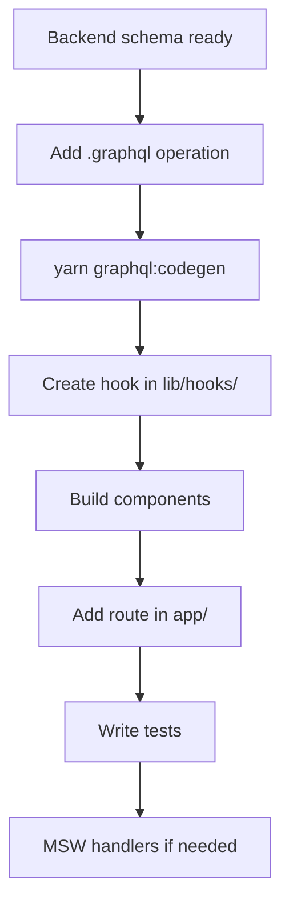

# Feature Development (Storefront)

End-to-end guide for implementing a storefront feature.

## Workflow



## Example: surface unread notification count

The unread count query already exists. Prefer composing the existing molecule rather than inventing a parallel API.

### 1. Confirm the schema field

`notifications.graphql` already defines:

```graphql
query UnreadCount {
  unreadNotificationsCount
}
```

Backend field: `unreadNotificationsCount` in `../sopet-backend/src/schema.gql`.

### 2. Codegen (only if you changed `.graphql` files)

```bash
yarn graphql:codegen
```

### 3. Use the existing UI hook / molecule

`src/components/molecules/UnreadBadge.tsx` already calls `UnreadCountDocument`. Import it wherever the badge should appear (for example the account nav).

If you need list data instead of a count, use `useNotifications` from `src/lib/hooks/useNotifications.ts` (wired to `/user/notifications`).

### 4. Add or extend a test

```typescript
// Prefer MSW + createApolloTestWrapper for GraphQL-backed UI
import { createApolloTestWrapper } from '@/test/createApolloTestWrapper';
```

Override the `UnreadCount` handler in `src/test/mocks/handlers.ts` when asserting badge visibility.

## New page checklist

1. Route in the correct group (`(main)`, `(auth)`, `(checkout)`, `(payment)`)
2. Account routes under `user/layout.tsx` (wrapped by `AccountAuthGuard`) when auth is required
3. SSR preload for catalog-style pages (`revalidate`, `PreloadQuery`) when data should hydrate from the server
4. Thai user-facing copy
5. Mobile layout checked at common breakpoints
6. `yarn test` and `yarn lint` pass

## New checkout flow step

1. Add state to `CheckoutProvider`
2. Add validation / helpers in `src/lib/checkout/`
3. Wire mutation in `useCheckout.ts`
4. Update `src/components/sections/CheckoutSection/`
5. Test with MSW checkout fixtures under `src/test/mocks/fixtures/`

## Coordinating with backend

1. Land API/schema changes in `../sopet-backend` and regenerate `src/schema.gql`.
2. Run `yarn graphql:codegen` in this repo.
3. Implement UI/hooks; commit each repo separately.

Backend changes must merge and `schema.gql` update before storefront CI passes (CI sparse-checkouts the schema from GitHub).

## Related docs

- [Development guide](development-guide.md)
- [GraphQL](graphql.md)
