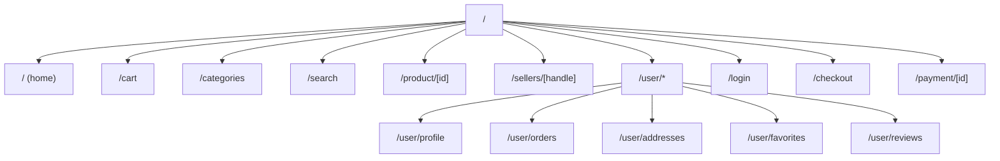

# Storefront Routing

Next.js 16 App Router with route groups (parentheses folders are URL-invisible).

## Route map



## Route groups

### `(main)` — `src/app/(main)/`

Public pages with full site chrome.

**Layout:** `src/app/(main)/layout.tsx`

- `Header` (navbar)
- `ConditionalFooter`
- `PromotionalAdsModal`

**Account sub-routes:** `src/app/(main)/user/`

- Protected by `AccountAuthGuard` in `user/layout.tsx`
- Redirects to `/login?returnUrl=...` when unauthenticated

### `(auth)` — `src/app/(auth)/`

| Route        | Component                |
| ------------ | ------------------------ |
| `/login`     | `LoginForm` molecule     |
| `/login/otp` | `OtpVerifyForm` molecule |
| `/signout`   | Clears tokens, redirects |

### `(checkout)` — `src/app/(checkout)/`

Single route `/checkout`. Uses `CheckoutProvider` state from root providers.

### `(payment)` — `src/app/(payment)/`

`/payment/[id]` — payment status page. Minimal layout (no header).

## Page patterns

### Pattern 1: Thin delegate

```typescript
// src/app/(main)/cart/page.tsx
import CartPage from '@/components/sections/CartPage';
export default function Page() { return <CartPage />; }
```

### Pattern 2: SSR with preload

```typescript
// src/app/(main)/product/[id]/page.tsx
export const revalidate = 60;

export default async function Page({ params }) {
  const { id } = await params;
  const client = getClient();
  const { data } = await client.query({
    query: ProductByIdDocument,
    variables: buildProductByIdVariables(id),
  });
  return (
    <PreloadQuery query={ProductByIdDocument} variables={...}>
      <ProductDetailsPage productId={id} />
    </PreloadQuery>
  );
}
```

### Pattern 3: Account page with prefetch

Account layout prefetches nav data on idle via `prefetchAccountPage.ts`.

## Redirects

In `next.config.ts`:

| Source                  | Destination                 |
| ----------------------- | --------------------------- |
| `/user/wishlist`        | `/user/favorites`           |
| `/user/reviews/written` | `/user/reviews?tab=written` |

## GraphQL proxy

`next.config.ts` rewrites `/graphql` → backend. Browser never calls `:3002` directly.

## No middleware

Storefront does not use `middleware.ts`. Auth is client-side via `AccountAuthGuard`.

## Adding a new page

1. Create route file in appropriate group under `src/app/`
2. Create page/section component in `src/components/`
3. Add data hook if needed in `src/lib/hooks/`
4. Add GraphQL operation in `src/lib/graphql/operations/`
5. Run `yarn graphql:codegen`

See [feature development](feature-development.md).

## Related docs

- [Architecture](architecture.md)
- [Authentication](../../new-sopet-workspace/docs/developer/authentication.md)
