# Storefront Routing

Next.js 16 App Router with route groups (parentheses folders are URL-invisible).

## Route map

```mermaid
flowchart TD
  ROOT["/"]
  ROOT --> HOME["/ (home)"]
  ROOT --> CART["/cart"]
  ROOT --> CAT["/categories/[category]"]
  ROOT --> SEARCH["/search"]
  ROOT --> PROD_LIST["/products → /search"]
  ROOT --> CAT_INDEX["/categories → /"]
  ROOT --> PROD["/product/[id]"]
  ROOT --> SELLER["/sellers/[handle]"]
  ROOT --> SELLER_REV["/sellers/[handle]/reviews"]
  ROOT --> USER["/user/*"]
  ROOT --> LOGIN["/login"]
  ROOT --> CHECKOUT["/checkout"]
  ROOT --> PAYMENT["/payment/[id]"]
  ROOT --> TRACK["/track/[orderNumber]"]
  ROOT --> CONFIRMED["/order/[id]/confirmed"]
  ROOT --> THANKYOU["/thank-you/[id]"]
  ROOT --> RECOMMEND["/recommend"]
  ROOT --> POLICY["/policy/*"]

  USER --> REGISTER["/user/register"]
  USER --> PROFILE["/user/profile"]
  USER --> ORDERS["/user/orders"]
  USER --> ADDR["/user/addresses"]
  USER --> FAV["/user/favorites"]
  USER --> REV["/user/reviews"]
  USER --> NOTIF["/user/notifications"]
  USER --> CREDIT["/user/credit"]
  USER --> DELETE["/user/delete"]
```



## Route groups

### `(main)` — `src/app/(main)/`

Public pages with full site chrome.

**Layout:** `src/app/(main)/layout.tsx`

- `Header` (navbar)
- `ConditionalFooter`
- `PromotionalAdsModal`

**Account sub-routes:** `src/app/(main)/user/`

- Protected by `AccountAuthGuard` in `user/layout.tsx`
- Redirects to `/login?returnUrl=...` when unauthenticated

### `(auth)` — `src/app/(auth)/`

| Route        | Component                |
| ------------ | ------------------------ |
| `/login`     | `LoginForm` molecule     |
| `/login/otp` | `OtpVerifyForm` molecule |
| `/signout`   | Clears tokens, redirects |

### `(checkout)` — `src/app/(checkout)/`

Single route `/checkout`. Uses `CheckoutProvider` state from root providers.

### `(payment)` — `src/app/(payment)/`

`/payment/[id]` — payment status page. Minimal layout (no header).

### `(main)` — `/track/[orderNumber]`

Public, unauthenticated order tracking page (capability URL — no login, no nav/footer links to it). Renders status, items, totals, shipping, and carrier link via `useOrderTracking` (`fetchPolicy: 'network-only'`); unknown/malformed order numbers and network errors render the same `OrderTrackingNotFoundState` copy for one, distinct `OrderTrackingErrorState` for the other. Shared with the authenticated order detail page via `OrderShipmentTrackingList`. Linked from the admin vendor orders action menu (copy-link dialog), not surfaced anywhere in storefront navigation.

### `(main)` — other routes

| Route                                                                                                                                 | Purpose                                                                         |
| ------------------------------------------------------------------------------------------------------------------------------------- | ------------------------------------------------------------------------------- |
| `/order/[id]/confirmed`                                                                                                               | Post-checkout confirmation (`OrderConfirmedContent` co-located under the route) |
| `/thank-you/[id]`                                                                                                                     | Post-payment thank-you page (`ThankYouPageContent` co-located under the route)  |
| `/recommend`                                                                                                                          | Recommended-products landing page                                               |
| `/policy/privacy-policy`                                                                                                              | Privacy policy (Markdown via `PolicyMarkdownLayout`)                            |
| `/policy/terms-of-service`                                                                                                            | Terms of service                                                                |
| `/policy/refund-policy`                                                                                                               | Refund policy                                                                   |
| `/sellers/[handle]/reviews`                                                                                                           | Seller review list page                                                         |
| `/user/register`                                                                                                                      | Complete profile after first OTP login                                          |
| `/user/notifications`                                                                                                                 | Notification list (`useNotifications`)                                          |
| `/user/credit`, `/user/credit/add`                                                                                                    | Stored payment methods (`usePaymentMethods`)                                    |
| `/user/delete`                                                                                                                        | Account deletion flow                                                           |
| `/user/profile/dob`, `/user/profile/email/add`, `/user/profile/email/change`, `/user/profile/phone/add`, `/user/profile/phone/change` | Profile field editors, one route per field                                      |

### Root-level SEO routes

Outside any route group — Next.js file conventions:

| Route          | File                        |
| -------------- | --------------------------- |
| `/robots.txt`  | `src/app/robots.ts`         |
| `/sitemap.xml` | `src/app/sitemap.ts`        |
| `/llms.txt`    | `src/app/llms.txt/route.ts` |

See [SEO](seo.md).

## Page patterns

### Pattern 1: Thin delegate

```typescript
// src/app/(main)/cart/page.tsx
import CartPage from '@/components/sections/CartPage';
export default function Page() { return <CartPage />; }
```

### Pattern 2: SSR with preload

```typescript
// src/app/(main)/product/[id]/page.tsx
export const revalidate = 60;

export default async function Page({ params }) {
  const { id } = await params;
  const client = getClient();
  const { data } = await client.query({
    query: ProductByIdDocument,
    variables: buildProductByIdVariables(id),
  });
  return (
    <PreloadQuery query={ProductByIdDocument} variables={...}>
      <ProductDetailsPage productId={id} />
    </PreloadQuery>
  );
}
```

### Pattern 3: Account page with prefetch

Account layout prefetches nav data on idle via `prefetchAccountPage.ts`.

## Redirects

In `next.config.ts`:

| Source                  | Destination                 |
| ----------------------- | --------------------------- |
| `/products`             | `/search`                   |
| `/categories`           | `/`                         |
| `/user/wishlist`        | `/user/favorites`           |
| `/user/reviews/written` | `/user/reviews?tab=written` |

## GraphQL proxy

`next.config.ts` rewrites `/graphql` → backend. Browser never calls `:3002` directly.

## No middleware

Storefront does not use `middleware.ts`. Auth is client-side via `AccountAuthGuard`.

## Adding a new page

1. Create route file in appropriate group under `src/app/`
2. Create page/section component in `src/components/`
3. Add data hook if needed in `src/lib/hooks/`
4. Add GraphQL operation in `src/lib/graphql/operations/`
5. Run `yarn graphql:codegen`

See [feature development](feature-development.md).

## Related docs

- [Architecture](architecture.md)
- [SEO](seo.md)
