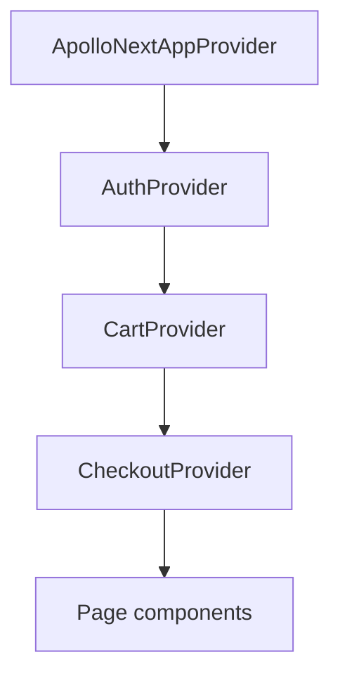

# State Management

Storefront uses **Apollo Client cache + React Context**. No Redux or Zustand.

## Provider hierarchy

Defined in `src/lib/providers.tsx`.

## AuthProvider

**File:** `src/lib/providers/AuthProvider.tsx`

| State             | Source                                          |
| ----------------- | ----------------------------------------------- |
| `customer`        | Apollo `MeDocument` query                       |
| `isAuthenticated` | Token in sessionStorage + successful `me` query |
| `isLoading`       | Initial auth hydration                          |

| Methods                  | GraphQL                                     |
| ------------------------ | ------------------------------------------- |
| `sendOtp(phone)`         | `SendCustomerOtpDocument`                   |
| `verifyOtp(phone, code)` | `VerifyCustomerOtpDocument`                 |
| `logout()`               | Clears tokens + `apolloClient.clearStore()` |

**Hook:** `src/lib/hooks/useAuth.ts` (thin context wrapper)

**Tokens:** `sessionStorage` via `src/lib/graphql/authLink.ts`

- `sopet_access_token`
- `sopet_refresh_token`

## CartProvider

**File:** `src/lib/providers/CartProvider.tsx`

| State      | Source                                     |
| ---------- | ------------------------------------------ |
| Cart items | `CartDocument` query                       |
| Selection  | `sessionStorage` (`sopet.cart.deselected`) |

| Behavior    | Detail                                              |
| ----------- | --------------------------------------------------- |
| Guest cart  | Passes `sessionId` from `getSessionId()`            |
| Login merge | `MergeCartDocument` on OTP verify                   |
| Mutations   | `AddToCartDocument`, `UpdateCartItemDocument`, etc. |

**Hook:** `useCart()` exported from same file.

## CheckoutProvider

**File:** `src/lib/providers/CheckoutProvider.tsx`

Pure React `useState` — no GraphQL inside provider:

- Current step
- Shipping address (saved or inline)
- Per-store shipping selection
- Promotion codes
- Payment method selection

**Mutations** go through `src/lib/hooks/useCheckout.ts`:

- `CreateOrderDocument`
- `CreatePaymentDocument`
- Promotion validation queries

**Business logic:** `src/lib/checkout/submitCheckout.ts`

## Apollo cache

**File:** `src/lib/graphql/cachePolicies.ts`

Key policies:

- `ProductType` keyed by `id`
- `me` and `cart` merge strategies

## Guest session

**File:** `src/lib/session.ts`

Cookie `sopet_session_id` (UUID v4) for anonymous cart persistence.

## Token refresh

**File:** `src/lib/graphql/authLink.ts`

On 401/UNAUTHENTICATED:

1. Call `RefreshTokenDocument`
2. Retry original request once
3. On failure: `notifyAuthFailure()` → logout

## Related docs

- [GraphQL](graphql.md)
- [Hooks](hooks.md)
